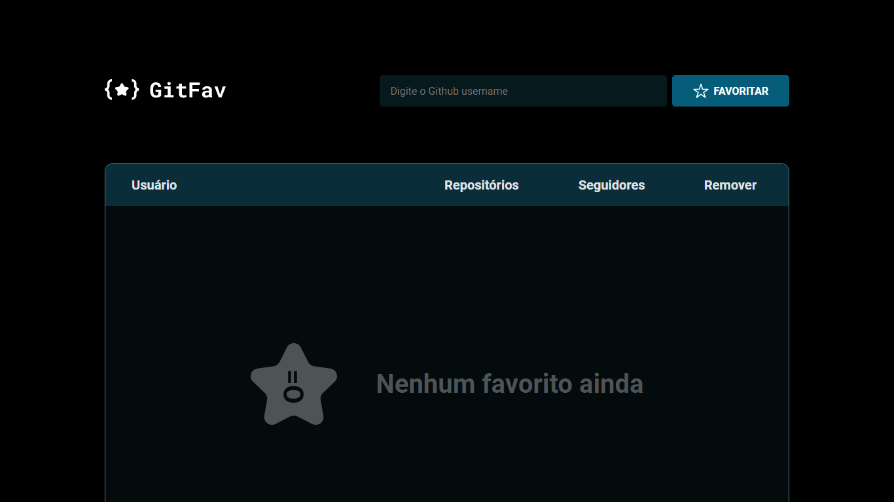

## Desafio 03 do nível 06 - Gitfav ⭐️

Página inicial sem nenhum perfil favorito:

Aplicação com perfis favoritos cadastrados:

## :dart:  Desafio

Desafio 06 do Explorer da Rocketseat, cujo objetivo foi a criação de uma página de favoritos do GitHub, sendo possível adicionar ou remover favoritos, mostrando o usuário, a quantidade de repositórios e seguidores dos perfis favoritos.

A aplicação começa resetada, com a lista de usuários vazia, sendo informado na tela que não há nenhum favorito ainda.

Caso o usuário tente adicionar um perfil que não existe, receberá uma mensagem de alerta informando que o usuário não foi encontrado. Caso tente inserir um perfil repetido, receberá uma mensagem de alerta informando que o usuário já está cadastrado. Caso deseje remover um dos perfis favoritos, será solicitada a confirmação se deseja realmente excluir o usuário selecionado.

## :nut_and_bolt: Principais pontos abordados

* html
* css
* javascript modulo
* tabelas HTML
* fazer um elemento html sumir da tela mas pro leitor de tela  ele funcionará
* sudoclasses
* sudoelements
* sudoselector
* orientação a objeto no javascript usado o extends
* localstorage da DOM
* funçoes assincronas
* promessas com javascript
* try catch throw (tratamento de erros)
* raier order function(toda função que recebe uma função como argumento e retorna essa função)
* programação funcional: um dos pricipios é imutabilidade dos dados
* DOM
* eventos
* prenchendo conteúdos
* como Criar um elemento pelo javascript
* como remover elementos html da tela
* api
* json
* estrutura e manipulação dos dados

## :mailbox_closed: Contatos

> Email - rosendc30@gmail.com

> Linkedin - https://www.linkedin.com/in/francisco-rosendo-coelho/# gitfavorites
